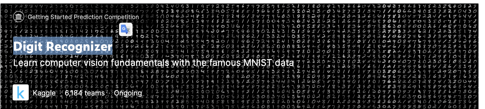

# kaggle-CommonLit-Readability-Prize
CommonLit Readability Prizeコンペのリポジトリ

## Basics

## info
参考nb
- https://www.kaggle.com/ruchi798/commonlit-readability-prize-eda-baseline/comments#Pre-processing-excerpt-%E2%9C%82%EF%B8%8F
- https://www.kaggle.com/yuichihiguchi/commonlit-readability-prize-eda

## Overview
機械学習は、文章の適切な読解レベルを特定し、学習意欲を高めることができるのか？読書は、学業の成功に不可欠なスキルです。適切なレベルの課題を提供する魅力的な文章に触れることができれば、生徒は自然にリーディングスキルを身につけることができます。

現在、ほとんどの教育用テキストは、伝統的な読みやすさの方法や市販の計算式を使って読者に合わせています。しかし、それぞれに問題があります。Flesch-Kincaid Grade Levelのようなツールは、テキストのデコーディング（単語あたりの文字数や音節数など）や構文の複雑さ（文章あたりの単語数など）の弱い指標に基づいている。そのため、構成要素や理論的妥当性に欠けています。また、Lexileのように市販されている計算式は、コストが高く、適切な検証研究が行われておらず、計算式の特徴が公開されていないため、透明性の問題があります。

CommonLit, Inc.は、非営利の教育技術団体で、2,000万人以上の教師と生徒に、3年生から12年生までの無料のデジタルリーディングとライティングのレッスンを提供しています。アトランタにあるR1の公立研究大学であるジョージア州立大学と共同で、読みやすさの評価方法を改善するためにカグラーに挑戦しています。

このコンペティションでは、3年生から12年生のクラスで使用するために、**読み物の複雑さを評価するアルゴリズムを構築します。**そのためには、様々な年齢層の読者と、様々な分野から集められた大量のテキストを含むデータセットに、自分の機械学習スキルを組み合わせます。受賞モデルには、テキストのまとまりとセマンティクスが必ず組み込まれます。

成功すれば、管理者、教師、生徒の助けになるでしょう。パッセージを選ぶリテラシーカリキュラムの開発者や教師は、教室で使う作品を迅速かつ正確に評価できるようになります。さらに、これらの計算式は誰もが利用しやすくなります。おそらく最も重要なことは、生徒が自分の作品の複雑さや読みやすさについてのフィードバックを受けることができ、本質的なリーディングスキルをはるかに容易に向上させることができるということです。

www.DeepL.com/Translator（無料版）で翻訳しました。

## Evaluation
 評価指標は、RMSE.

## input
与えられたデータセットの詳細を書く。

今回のコンペでは、文学作品の抜粋の読みやすさを予測します。いくつかの時代の抜粋を用意し、読みやすさのスコアも幅広く用意しました。テストセットには、トレーニングセットよりも現代のテキスト（一般化したいタイプのテキスト）の割合が若干多いことに注意してください。

また、公開テストセットにはライセンス情報が提供されていますが（関連する抜粋が表示/使用可能であるため）、非表示のプライベートテストセットにはライセンス/法的情報が空白でしか含まれていないことにも注意してください。

|filename|file size|shape|comment|
|----|---|---|---|
|train.csv|2.79M|(2834, 6)|---|
|test.csv|6.79K|(7, 4)|---|
|sample_submission.csv|108B|(7, 2)|---|

## features
**train.cv**
- shape: (2834, 6)

|columns|dtype|detail|
|---|---|---|
|id|object||
|url_legal|object|URL記載。テストセットではブランク。欠損値2004|
|license|object|ライセンス記載。テストセットではブランク。欠損値2004|
|excerpt|object|読みやすさを予測するテキスト（予測対象）|
|target|float64|読みやすさのスコア。-3.68~1.71|
|standard_error|float64|各テキストの評価者間のスコアの標準誤差。テストセットでは含まれていない。|

**test.csv**
- shape: (7,4)

|columns|dtype|detail|
|---|---|---|
|id|object||
|url_legal|object|欠損値4|
|license|object|欠損値4|
|excerpt|object||

# Log

### 20210703
- join
- data download
- data size list

- nb001
    - inputデータのEDAを行った
    - サイズ、各カラムの説明を確認
    - excerpt (抜粋) から、人によってつけられた文章の読みやすさスコアみたいなの（target）をを当てる.スコアは複数人でつけるため、人による採点ばらつき（standard error）がある
    - 例えば、excerpt[0]の文章の読みやすさスコアは-0.34で、その評価スコアは人により0.46のばらつきがある。
    - pandas_profiling, wordcloudをpip install
    - pandas_profiling : EDA用。めっちゃ便利。
    - wordcloud : 文章中で出現頻度が高い単語を複数選び出し、その頻度に応じた大きさで図示する手法のこと
    - profile結果は data/info/profile.html
    - iterrows(): DataFrameをそのままforループに突っ込むと、カラム名が順番に出てくる。そこで、iterrows()メソッドを使うと、１行ずつ、インデックス名（行名）とその行のデータ（pandas.Series型）のタプル(index, Series)を取得できる

#### sns.histplotの引数について
- alpha: 透明度。0.0~1.0
- discrete:　離散。離散値の場合はTrueにするのか？
- cbar: Trueの場合、カラ-バーを追加して注釈をつける。図３についてるな。
- cbar_kwd: 辞書型パラメータを渡すことで、matplotlibのfig.colorbarにパラメータを渡すことができる。この例では、fig.colorbarにカラーバーの短さを設定するshrinkパラメータ=0.75を渡した。

#### nltkとは
英語を形態素解析できるツール。

形態素とは、言葉が意味を持つまとまりの単語の最小単位のこと。

NLTKとはNatural Language Tool Kitの略称で、Python用ライブラリ。

stopwordsとは：　"a", "the", "an", "in"などの冠詞や、"i", "my", "we"などの主語、など、検索エンジンが無視するようプログラムされている単語。
参考：　https://www.geeksforgeeks.org/removing-stop-words-nltk-python/

lemmatizeとは：

lemma（レマ）：見出し語, 辞書に載っている形式の単語

lemmatize: 見出し語に変換すること。

例 meet, meeting)

I'll attend meeting. 変換後 - meeting

I met him last night. 変換後 - meet